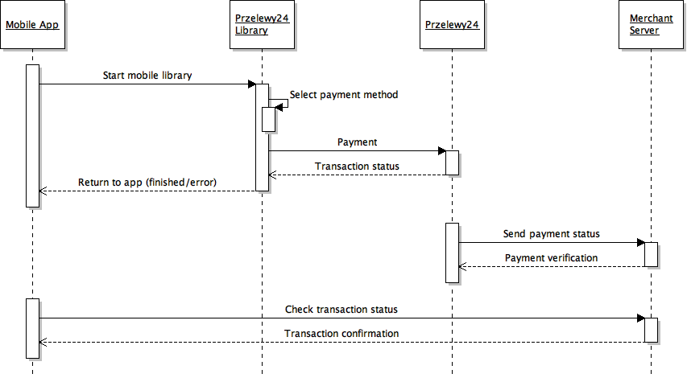

# Przelewy24 mobile library documentation

Przelewy24 mobile libraries provides the possibility of integrating Przelewy24 payments with mobile applications as it is the case with web payments. The documentation below is based on the www payment integration documentation:

[Przelewy24 payment integration documentation](https://developers.przelewy24.pl/index.php?en)

In order to carry out integration with Przelewy24, merchant’s details must be provided. In order to get them, contact the sales department:
- Tel: +48 61 642 93 45
- Email: <oferty@przelewy24.pl>

## 1. System description

Przelewy24 mobile libraries are native libraries for Android and iOS platforms. They enable payments within mobile applications without having to switch users between a given application, a web browser or yet another application. The entire transaction process is carried out in one application window. The libraries offer different methods of payment, e.g. bank transfers, payment cards, BLIK, virtual wallets (PayPal, SkyCash, etc.).

### 1.1 How does a transaction with the use of a mobile library proceed?

Once the payment is called, a payment window is displayed on the smartphone screen. The window contains a WebView control with przelewy24.pl transaction system loaded. After the payment method is selected, the website of the selected bank/method is loaded in the same window. The user logs on to their account or provides the necessary payment details (e.g. payment card details, BLIK code, etc.) and next, accepts the payment. The library window closes with the status "payment finished" or the error code (e.g. if the user logged out of the bank without accepting the payment or provided the wrong BLIK code).

### 1.2 Initiating the transaction

To initiate transaction it is necessary to register it with a separate query from the partner’s server. You can find description of the transaction in payment documentation [link](https://developers.przelewy24.pl/index.php?en#tag/Transaction-service-API/paths/~1api~1v1~1transaction~1register/post).

If transaction is dedicated to the mobile library, the following parameters have to be provided during the registration: `mobileLib=1` and `sdkVersion=X`, with mobile library version number. Value of this parameter may be downloaded directly from library from class `P24SdkVersion` (iOS - `P24SdkVersion.value`, Android - `P24SdkVersion.value()`).

As a result, a TOKEN is generated. In order to initiate transaction in mobile library, token must be provided to the `Transfer` method.

**NOTE!**

 > When registering the transaction which is to be carried out in a mobile library, one has to remember about the following parameters:
- `channel` – unless set, the library will feature the payment options „traditional transfer” and „use prepayment”, which are unnecessary in case of mobile payments. In order to deactivate them, use flags that disregard these forms (e.g. value 3 – payments and cards)
- `method` – if a given transaction in the library is to have a specific, preset method of payment, this method must be selected during the registration
- `urlStatus` -  the address to be used for transaction verification by the partner’s server once the payment process in the mobile library is finished

### 1.3 Transaction verification

After the payment is made, the library finishes operation and returns to the application. It does not wait for the transaction to be posted in Przelewy24. The library yields the  `paymentFinished`, or `paymentError` status if anything has gone wrong. At the time the payment is posted, Przelewy24 sends an asynchronous notification to the address `urlStatus` provided by the partner during the configuration process. Upon receive of the notification, the partner’s server must send a transaction verification request to Przelewy24. At that time, the merchant’s server possesses information that the payment has been posted. Then, the application should call its server to check the transaction status.   

The `urlStatus` parameter must be set in the transaction panel (in order to do so, send the address of the script to  [serwis@przelewy24.pl](serwis@przelewy24.pl) from the e-mail address provided during account registration).

## 2. Definitions

- **Merchant** - Institution or private person using the services of PRZELEWY24.

- **Session ID** - Unique ID used for the verification of single transaction details. The ID is obtained from the merchant.

- **CRC** - Random string of characters used to generate the control sum of the parameters sent. The CRC may be downloaded from Przelewy24 panel
