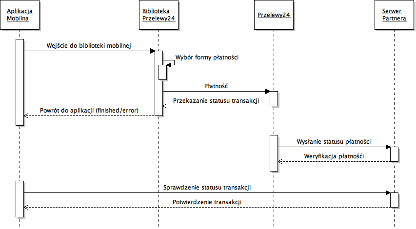

# Dokumentacja bibliotek mobilnych Przelewy24

Biblioteki mobilne Przelewy24 umożliwiają integrację płatności Przelewy24 w aplikacjach mobilnych, analogicznie jak w przypadku płatności web. Poniższa dokumentacja bazuje na dokumentacji integracji płatności www:

[Dokumentacja integracji płatności www Przelewy24](https://www.przelewy24.pl/storage/app/media/pobierz/Instalacja/przelewy24_dokumentacja_3.2.pdf)

Aby móc dokonać integracji z systemem Przelewy24 niezbędne są dane sprzedawcy. Jeżeli ich nie posiadasz, możesz je uzyskać kontaktując się z działem handlowym:
- Tel: +48 61 642 93 45
- Email: <oferty@przelewy24.pl>

### Szczegóły integracji dla poszczególnych platform znajdziesz pod poniższymi linkami:

- [Android](https://github.com/przelewy24/p24-mobile-lib-android)
- [iOS](https://github.com/przelewy24/p24-mobile-lib-ios)

## 1. Opis systemu

Biblioteki mobilne Przelewy24 to natywne biblioteki na platformę Andoid i iOS. Umożliwiające wykonanie płatności
wewnątrz aplikacji mobilnej, bez konieczności przełączania użytkownika między aplikacją, a
przeglądarką lub inną aplikacją. Cały proces płatności odbywa się w jednym oknie aplikacji.
W bibliotekach dostępne są różne metody płatności: przelewy bankowe, karty płatnicze, BLIK, wirtualne portfele (np. PayPal, SkyCash) i inne.

### 1.1 Jak wygląda przebieg transakcji przy użyciu biblioteki mobilnej?

Po wywołaniu płatności na ekranie smartfonu pojawia się okno płatności, zawierające
kontrolkę WebView z załadowanym serwisem transakcyjnym przelewy24.pl. Po wybraniu
metody płatności w tym samym oknie ładuje się strona wybranego banku/metody. Użytkownik loguje się do swojego konta,
albo podaje dane potrzebne do płatności (np. dane karty, kod BLIK). Następnie użytkownik
zatwierdza płatność. Okno biblioteki zmayka się ze statusem "płatność zakończona" albo z kodem błędu
(np. jeżeli wylogowano się z banku bez potwierdzenia płatności, albo podany błędny kod BLIK).

### 1.2 Inicjowanie płatności

Biblioteka umożliwia zainicjowanie transakcji na dwa sposoby:

- podając dane transakcji bezpośrednio w bibliotece
- rejestrując wcześniej transakcję z poziomu serwera sprzedawcy i przekazując do biblioteki otrzymany przy rejestracji token transakcji

### 1.2.1 Wejście bezpośrednio z danymi transakcji

Aby zainicjować transakcję bezpośrednio parametrami płatności, należy wywołać metodę `trnDirect` i przekazać do niej id partnera (`merchantId`), kod `CRC` (dostępny w panelu
partnera) oraz dane o transakcji - kwotę (wyrażoną w groszach), walutę (np. „PLN”), e-mail klienta, oraz id sesji (unikalne dla każdej transakcji). Dodatkowo można podać dane adresowe klienta
(nazwisko, adres, miasto, kod pocztowy, kraj), które są wymagane dla płatności kartą, oraz
opis transakcji, który będzie wyświetlany w panelu transakcyjnym Przelewy24.

### 1.2.2 Wejście z tokenem transakcji

Możliwe jest zarejestrowanie transakcji za pomocą osobnego zapytania z serwera partnera. Opis rejestracji transakcji znajduje się w dokumentacji płatności www [link](https://www.przelewy24.pl/storage/app/media/pobierz/Instalacja/przelewy24_dokumentacja_3.2.pdf).

Jeżeli transakcja ma być zrealizowana w bibliotece mobilnej, przy rejestracji należy dodać parametry: `p24_mobile_lib=1` oraz `p24_sdk_version=X`, w którym należy podać numer wersji biblioteki mobilnej. Wartość tego parametru można pobrać bezpośrednio z biblioteki (iOS - klasa `P24`, Android - klasa `P24SdkVersion`).

W wyniku rejestracji transakcji otrzymujemy TOKEN. Aby zainicjować transakcję w bibliotece mobilnej wystarczy przekazać ten token do metody `trnRequest`.

**UWAGA!**

 > Rejestrując transakcję, która będzie wykonana w bibliotece mobilnej należy
pamiętać o dodatkowych parametrach:
- `p24_channel` – jeżeli nie będzie ustawiony, to domyślnie w bibliotece pojawią się
formy płatności „przelew tradycyjny” i „użyj przedpłatę”, które są niepotrzebne przy płatności mobilnej. Aby wyłączyć te opcje należy ustawić w tym parametrze flagi nie
uwzględniające tych form (np. wartość 3 – przelewy i karty, domyślnie ustawione w
bibliotece przy wejściu `trnDirect`)
- `p24_method` – jeżeli w bibliotece dla danej transakcji ma być ustawiona domyślnie
dana metoda płatności, należy ustawić ją w tym parametrze przy rejestracji
- `p24_url_status` - adres, który zostanie wykorzystany do weryfikacji transakcji przez serwer partnera po zakończeniu procesu płatności w bibliotece mobilnej

### 1.3 Weryfikacja poprawności transakcji

Po dokonaniu wpłaty biblioteka kończy pracę i wraca do aplikacji. Nie czeka na zaksięgowanie jej w systemie Przelewy24 – zwraca do aplikacji status `paymentFinished` albo `paymentError` jeżeli coś poszło nie tak.
W momencie zaksięgowania
wpłaty system Przelewy24 wysyła asynchronicznie powiadomienie o transakcji na adres `p24_url_status` podany przez partnera w konfiguracji. Serwer partnera po odebraniu powiadomienia musi wysłać do Przelewy24 żądanie weryfikacji transakcji. W tym momencie serwer sprzedawcy posiada informację o zaksięgowaniu wpłaty. Aplikacja powinna wtedy odpytać swój serwer o status transakcji. 

Parametr `p24_url_status` należy ustawić w panelu transakcyjnym (w tym celu należy przesłać adres skryptu na [serwis@przelewy24.pl](serwis@przelewy24.pl) z
adresu e- mail, na który jest założone konto), albo w bibliotece:
`paymentParams.setUrlStatus("http://XXXXXX")`
Ustawienie w bibliotece ma większy priorytet od ustawienia w panelu transakcyjnym.

## 2. Definicje

- **Sprzedawca** - Instytucja lub osoba prywatna korzystająca z usług serwisu PRZELEWY24.

- **Identyfikator sesji** - Unikalny identyfikator służący do weryfikacji danych pojedynczej
transakcji. Identyfikator ten pobierany jest od sprzedawcy.

- **CRC** - Losowy ciąg znaków służący do generowania sumy kontrolnej przesyłanych
parametrów, do pobrania z panelu Przelewy24.
